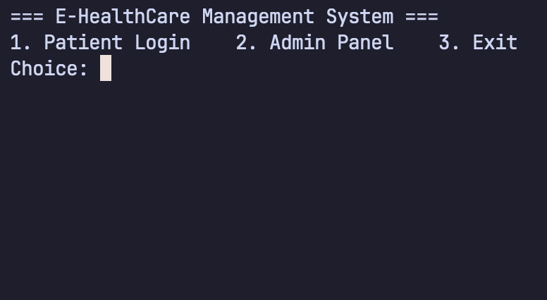
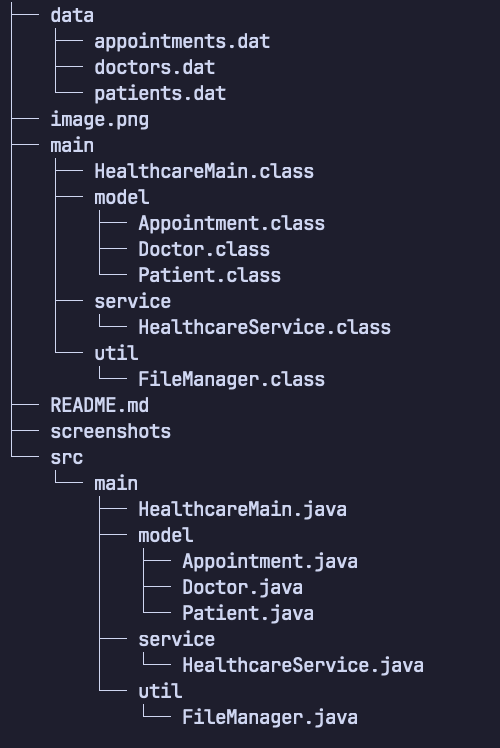

# E-HealthCare Management System


## Overview
Console-based Java application for managing healthcare operations including patient
registration, doctor management, appointment booking, and admin reporting. Built for
Java course projects with full OOP implementation, data persistence, and collection-
based data management.


## Features
- **Patient Management**: Register new patients, view patient details
- **Doctor Management**: Add/remove doctors, view doctor availability (5 slots max)
- **Appointment System**: Book appointments with availability checks, view patient
  appointments
- **Admin Panel**: Full CRUD operations with authentication (password: `admin123`)
- **Data Persistence**: Automatic save/load using file serialization
- **Reports**: Appointment statistics and busy doctor summaries
- **Input Validation**: ID uniqueness, slot availability, error handling

## Technologies Used

Language: Java 8+  
Collections: ArrayList, HashMap  
Persistence: ObjectOutputStream/ObjectInputStream  
UI: Console (Scanner)  
Design: OOP (Encapsulation, Single Responsibility)

## Project Structure


## Installation & Setup

### Prerequisites

- Java JDK 8 or higher

### Steps

1. **Create project directory:**

```bash
mkdir HealthcareManagement && cd HealthcareManagement
mkdir -p src/main/{model,service,util} data
```

2. **Copy all Java files to their respective `src/main/` packages
3. **Compile:**

```bash
javac -d . src/main/**/*.java
```
4. **Run**
```bash
java main.HealthcareMain
```

## Testing Instructions

Start by adding a logging to the the admin panel using the passowrd 'admin123'.
Follow the the instructions and add the doctors and patients from the Admin Panel.
